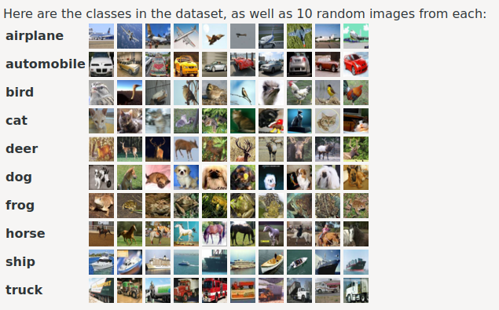

# CIFAR-10

Classify images from CIFAR-10 dataset. The CIFAR-10 dataset consists of 60000 32x32 colour images in 10 classes, with 6000 images per class. There are 50000 training images and 10000 test images. 

## Instructions
1. Download CIFAR-10 python version from the [CIFAR-10 website](https://www.cs.toronto.edu/~kriz/cifar.html){:target="_blank"}.
2. Extract cifar-10-python.tar.gz.

