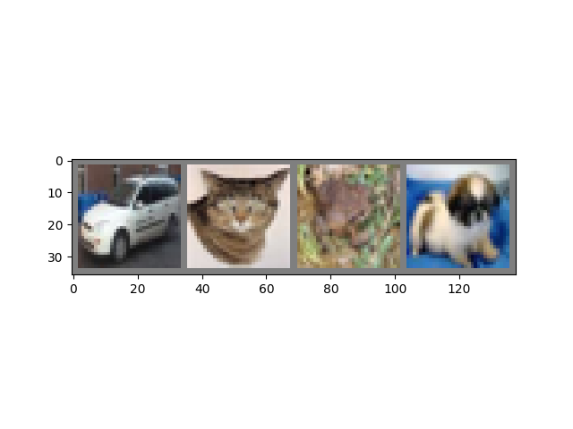

# CIFAR-10

Classify images from CIFAR-10 dataset. The CIFAR-10 dataset consists of 60000 32x32 colour images in 10 classes, with 6000 images per class. There are 50000 training images and 10000 test images. 

## Instructions
1. Download CIFAR-10 python version from the [CIFAR-10 website](https://www.cs.toronto.edu/~kriz/cifar.html).
2. Extract cifar-10-python.tar.gz. 
3. Run python train.py.
4. Once training is over, run python view_predictions.py.

## Results

Training Loss vs Epochs.

Test Accuracy vs Epochs. Achieved around 76% accuracy after nearly 75 epochs. These are expected results as we used a simple CNN architecture and also did not perform any data augmentation. 

Sample Prediction #1

Sample Prediction #2

Sample Prediction #3

