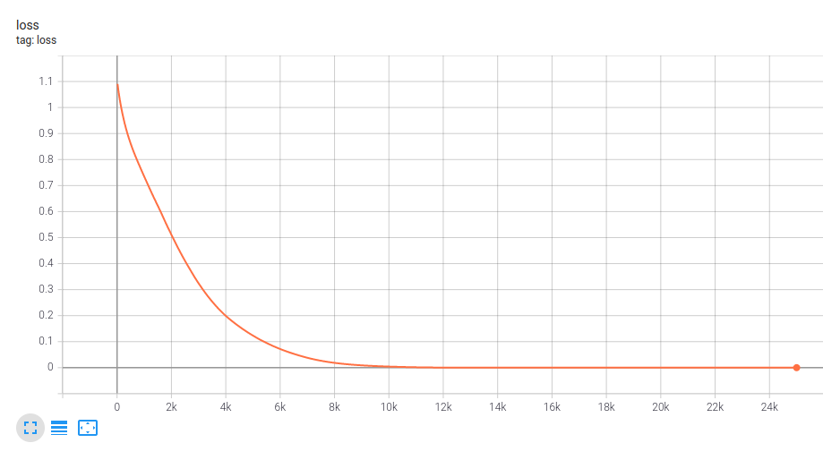

# hello_world

Basic example illustrating the supervised learning pipeline in Pytorch. Train a fully connected neural network to map a random input tensor to a random output tensor.

## Results

The loss function plot should look like this, indicating that training was successful.

