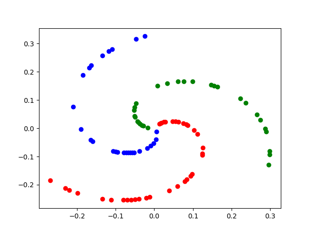

# Spiral Dataset

A simple 3-class classification problem.

## Instructions
1. To generate the dataset, run python generate_data.py.
3. To train, run python train.py.
4. Once training is over, to view predictions, run python view_predictions.py.

## Results

Training Data.

Training Loss vs Epochs.

Test Loss vs Epochs.

Test Accuracy vs Epochs. Achieved nearly 100% accuracy on test data.

Predictions on test data visualized.

